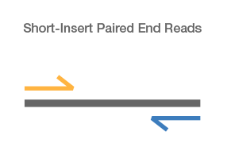
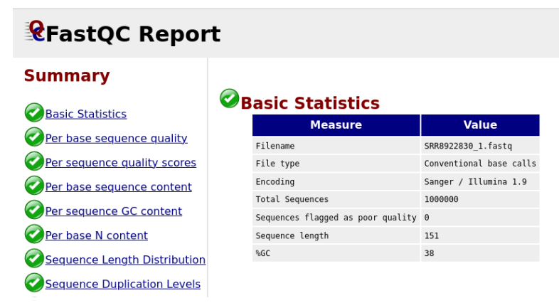

# 🧮 Practical 01 – Sequencing Reads and Quality Control

## Introduction
In Illumina genome sequencing projects, the DNA of the target organism is fragmented into millions of small pieces during library preparation, generating sequences (reads) typically between 36 and 300 nucleotides in length. These reads can be produced as single-end or paired-end data. Each fragment is sequenced independently, resulting in millions of overlapping reads that originate from multiple copies of the same genomic regions. By detecting these overlaps, assemblers can reconstruct the original genome sequence, joining reads into longer contiguous sequences known as contigs. The accuracy and completeness of this reconstruction depend largely on the coverage, i.e., the number of times each base is represented among the reads—the higher the coverage, the more reliable the assembly.

Paired-end reads are generated when both ends of DNA fragments are sequenced (the fragments are longer than the reads themselves). Sequencing proceeds inward from both ends, producing two reads per fragment with a known approximate insert size (more precisely, a random variable with a known distribution). This additional information from paired-end reads is very useful during the genome assembly process.  


  
&nbsp;

Genome assembly refers to the process of taking a set of short DNA sequences (reads) that represent a random collection of the genome, and “stitching” them together to create a representation of the original chromosomes. The goal of an assembler is to produce long contiguous sequences (contigs) from these reads. This is a computationally complex problem, further complicated by the presence of repetitive sequences in genomes.

In this guide we will:
- Obtain sequencing reads  
- Inspect and evaluate read quality  
- Filter and trim reads to improve quality if necessary  

For each step of the protocol, different tools are available, each with strengths and weaknesses. The suggested tools can be replaced with alternatives depending on user preference or the specific problem.

---
## Before starting

Make sure you are in the correct working directory to run this practical.
You will need to do this every day before starting the exercises.
```bash
# Enter the course folder
cd essentials_bioinformatics_2025/

# List the contents
ls

# Enter the folder corresponding to the current day (in this case, day1)
cd day1
```

## Data retrieval and manipulation

### ℹ️ FASTQ format

Sequencing reads are usually stored in the FASTQ format, which has become the standard output for nearly all modern sequencing technologies. It combines the nucleotide sequence with its corresponding quality scores, allowing both base information and confidence values to be retained in a single file.
📘 For more details on the FASTQ format, see [Illumina FASTQ overview](https://knowledge.illumina.com/software/general/software-general-reference_material-list/000002211)

Each read is encoded in four lines:

1. @ + identifier (with sequencing metadata)
2. The raw nucleotide sequence
3. \+ (optionally repeating the identifier)
4. Quality string (Phred scores encoded in ASCII)

Each base in line 2 has a corresponding quality score in line 4.

### SRA Toolkit: `fastq-dump` and `prefetch`
NCBI-SRA (https://www.ncbi.nlm.nih.gov/sra) is a public repository for primary sequence data, especially from second- and third-generation sequencing technologies. 

&nbsp;


<font color="green">

### 🧩 Explore the entry ERR049934 in the sra database

 Enter the Run Browser by clicking on the accession “ERR049934” under the RUN column, and explore the Metadata/Analusis, etc

1. What sequencing strategy was used for this dataset? 

2. What organism or biological sample was sequenced? 

3. Are the reads single-end or paired-end? How many bases were generated in total?

</font>

&nbsp;

NCBI provides the **SRA Toolkit**, which facilitates data download and conversion into different formats.

- `prefetch` downloads an SRA accession in its native `.sra` binary format.  
- `fastq-dump` converts `.sra` files into FASTQ format.  

⛔ Example workflow:
```bash
# only an example, do not run it
prefetch ERR049934
# fastq-dump --split-files ERR049934.sra
```
Alternatively, fastq-dump can take the accession number directly, 

✅ downloading and converting on the fly:

```bash
# download only 1 million reads
fastq-dump -X 1000000 --split-files ERR049934
```


Here:

-X 1000000 → download only 1 million reads
--split-files → generate two FASTQ files for paired-end data.

After running fastq-dump, two FASTQ files will be generated in your working directory.

✅
```bash
# You can list them using:
ls

# To preview the first few lines of the first file:
head ERR049934_1.fastq

# To visualize the entire file, use one of the following commands:
more ERR049934_2.fastq
# or
less ERR049934_2.fastq

# Press Ctrl + C (or 'q' if using 'less') to exit the viewer.
```

### ℹ️ Quality control
High-throughput sequencing generates millions of reads, but sequencing technologies are not error-free. Each instrument may introduce different errors. Quality control (QC) is therefore an essential first step.

Phred score
The Phred quality score (Q) measures base call accuracy, that is, how confident the sequencer is in identifying each nucleotide (A, T, C, or G) during the reading process. Each “base call” corresponds to a single position in a read where the sequencing instrument assigns a nucleotide based on fluorescence intensity or signal interpretation.  

📌 The Phred quality score (Q) measures base call accuracy:

$𝑄 = −10log 10(𝑃)$

Where *P* is the probability of error.

* Q10 → 1 error every 10 bases (10% error)
* Q20 → 1 error every 100 bases (1% error)
* Q30 → 1 error every 1000 bases (0.1% error)

👉 Discussion: What is the lowest Phred score you would expect in your reads?


**Sequencing depth** (C) is the average number of times each nucleotide is sequenced:

$𝐶=𝑁L/𝐺$

Where:
N = number of reads
L = read length
G = genome size

From C we can estimate:

Expected coverage: $1−𝑒^-𝐶$
Expected number of contigs: $𝑁𝑒^−𝐶$


###  FastQC
https://www.bioinformatics.babraham.ac.uk/projects/fastqc/

FastQC provides a quick, graphical summary of sequence quality. Instead of inspecting each read, it summarizes distributions, helping us detect:

- Low mean quality
- Positional quality drop-off (e.g. at the 3′ end)
- Overrepresented sequences

✅ To run FastQC:

```bash
fastqc ERR049934_1.fastq ERR049934_2.fastq
```
This generates .html reports viewable in a browser.

✅ To visualize it, you can locate the files using the file browser and open them with a web browser, or use the terminal to open them:
```bash
# example
firefox ERR049934_1.fastqc.html 
```


&nbsp;

## Filtering and trimming reads
### Sickle
Sickle filters and trims reads based on quality and length.

✅ Example command for paired-end reads:

```bash
sickle pe -f ERR049934_1.fastq  -r ERR049934_2.fastq -t sanger  -o trimmed_pe1.fastq   -p trimmed_pe2.fastq   -s trimmed_se.fastq  -q 27 -l 90
```

Parameters:

-f / -r → input FASTQ files (forward, reverse)
-t → quality encoding type (e.g. sanger)
-o / -p → trimmed paired reads output
-s → orphan reads output (singletons)
-q → quality threshold
-l → minimum length threshold

✅ After trimming, rerun FastQC to check improvements:

```bash
fastqc trimmed_pe1.fastq trimmed_pe2.fastq
```
Visualize the .html reports viewable in a browser.

<font color="green">

### 🧩 Analyzing the FastQC report

Open the FastQC HTML report generated for your dataset and explore the main quality modules.

1. How does the per-base quality score change along the length of the reads? Are there regions with noticeably lower quality?

2. Does the GC content distribution look uniform or show irregular peaks? What could that indicate?

3. What happens with the sequence length distribution? Are all reads the same length or does it vary across the dataset?

</font>


### Summary of this session
By the end of this practical, you should:

* Understand how paired-end reads are generated
* Be familiar with the FASTQ format
* Be able to download data from SRA using the SRA Toolkit
* Run FastQC for quality control
* Perform trimming and filtering using Sickle