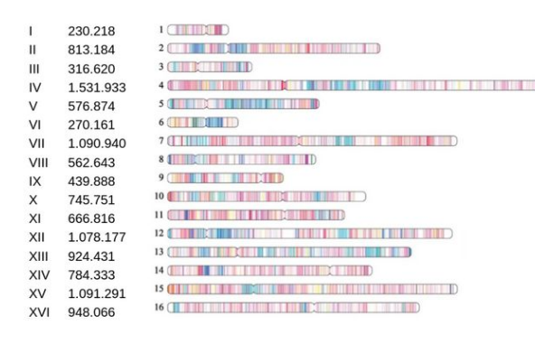
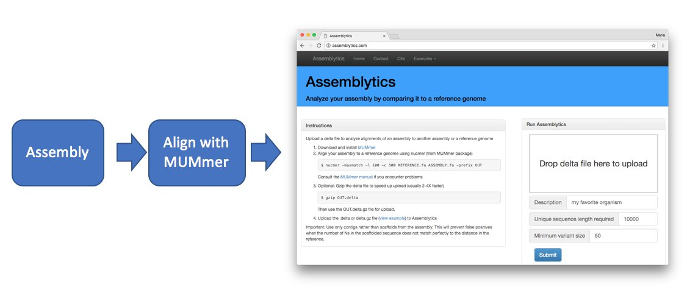

# 🧮 Practical 03 – Assembly Evaluation

The goal of the yeast genome assembly is to obtain something as similar as possible to this:

  
 &nbsp;

## Theoretical background

The quality of a genome assembly can be assessed using different **continuity and completeness statistics**, which reflect how fragmented or contiguous the reconstructed genome is.  
The most commonly used are:

- **N50:** the length of the contig such that the sum of all contigs of equal or greater length accounts for 50% of the total assembly size.  
  It is calculated by sorting all contigs from longest to shortest and summing their lengths until reaching half of the total assembly length.  
  Conceptually, it behaves like a *weighted median* of contig lengths.

- **N80, N90, etc.:** these are computed in the same way, representing the contig length that covers 80%, 90%, and so on, of the total assembly length.

- **L50:** the smallest number of contigs whose combined length makes up 50% of the assembly.  
  In other words, while *N50* gives a contig length threshold, *L50* gives the number of contigs needed to reach it.

**Example:**  
Given contig lengths [10, 20, 30, 40, 50, 60, 70, 80, 90, 100], the total assembly size is 550.  
Half of that (275) is reached with the sum of the four longest contigs (100 + 90 + 80 + 70 = 340).  
Thus, **N50 = 70** and **L50 = 4**.

These metrics, along with others such as the total number of contigs, overall length, and GC content, are used to evaluate and compare genome assemblies.

---

## ⚠️  Before starting

Before starting this practical, make sure to activate the conda environment that contains the required programs.
This ensures that all tools are available from the command line.

   ```bash
   conda activate day1
   ```
   
---


## 📂 Understanding assembly output files

Genome assemblers typically generate many intermediate and output files. This is normal — each file corresponds to a different stage of the assembly process. During assembly, the program builds graphs, contigs, and sometimes scaffolds, evaluating multiple parameters such as coverage, k-mer frequency, and paired-end information.
The final assembly is usually represented by a contig or scaffold FASTA file (for ABySS, files ending in -contigs.fa or -scaffolds.fa).
Other files store complementary information, such as read coverage histograms (*.hist), k-mer statistics, or temporary data used for graph construction.

Understanding which files are the final assembly and which are intermediate results is essential when comparing assemblers or evaluating assembly quality.

## 🔬 Evaluation of Illumina assemblies

1. **Copy the assemblies** generated with *abyss-pe* from /mnt/lab/Data/day1/abyss_yeast/ to your own folder.

   ```bash
   cp -r /mnt/lab/Data/day1/abyss_yeast/ ./
   ```
   
2. **Explore the results** in your working directory:

   ```bash
   cd abyss_yeast/
   ls -l
   head coverage.hist
   ```
   
3. Obtain assembly statistics using the infoseq tool (from the EMBOSS package) *infoseq -help* to visualize the options
   ```bash
infoseq -only -name -length -pgc yeast_k94-scaffolds.fa> table.out
   ```
  This generates a table listing each contig’s name, length, and GC content. 
  
  🧩 Visualize **table.out**. 
  

<font color="green">

#### 🧩 4. Analyze the results:

* Longest contig: **sort -n -k2 table.out**
* Number of contigs > 1 kb: **awk \'$2>1000\' table.out | wc -l**
* Total assembly length: **awk \'{s+=$2} END {print s}\' table.out**

</font>

  
#### Global summary:

5. The N50 value (as well as N90, L50, L90, total length, etc) can be calculated manually, for example by analyzing the table.out file in Excel or using command-line tools such as awk. However, there are already scripts and programs available that automatically generate the most common and relevant assembly statistics.
One of these tools is abyss-fac, which summarizes key metrics such as the total assembly length, number of contigs, N50, L50, and GC content in a single report.
    
   ```bash
    abyss-fac yeast_k94-scaffolds.fa
   ```
  
6. Generate a sub-assembly containing only contigs >2 kb:
  
   ```bash
awk '$2>2000 {print $1}' table.out > names.txt
# con grep 
grep -A1 -w -f names.txt yeast_k94-scaffolds.fa > contigs2Kb_abyss.fas
# con seqkit
seqkit grep -f names.txt yeast_k94-scaffolds.fa > contigs2Kb_abyss.fas
   ```
   


7. Compare your assembly to the reference genome (*S. cerevisiae* strain S288c) using BLASTN, and examine how many contigs align to each chromosome.

  
- 7.1. To do this, we will copy the reference assembly of the *Saccharomyces cerevisiae S288c* strain located at
/mnt/lab/Data/day1/genoma_ncbi/YEAST_chromosome.fas
into our working directory.

  ```bash
  # Check the current working directory
  pwd
  # Move one level up (to exit the abyss folder)
  cd ..
  # Copy the yeast reference genome to the current directory
  cp /mnt/lab/Data/day1/genoma_ncbi/YEAST_chromosome.fas ./
  ```
  
- 7.2. Run blastn
  
  ```bash
blastn -query abyss_yeast/yeast_k94-scaffolds.fa -subject YEAST_chromosome.fas -outfmt '6 std qlen slen' -out yeastk94_vs_Ref.blast
  ```
- 🧩 7.3. **Analyze the results:**

  ```bash
  # View the first lines of the BLAST output
  head yeastk94_vs_Ref.blast 
  # View only alignments longer than 10 Kb
  awk '$4 > 10000' yeastk94_vs_Ref.blast 
  # View only alignments longer than 10 Kb corresponding to Chromosome VIII
  awk '$4 > 10000' yeastk94_vs_Ref.blast | grep C_VIII
  ```
  

## 🧬 Evaluation of long-read assemblies

1. Visualize the final assemblies generated with Flye and copy the final output to your directory:
  
   ```bash
  ls /mnt/lab/Data/day1/flye_yeast/
  cp /mnt/lab/Data/day1/flye_yeast/assembly.fasta ./
   ```
   
2. Compute basic statistics using abyss-fac:

   ```bash
abyss-fac assembly.fasta
   ```
   
3. Compare your assembly to the reference genome (*S. cerevisiae* strain S288c) using BLASTN, and examine how many contigs align to each chromosome.

   ```bash
blastn -query assembly.fasta -subject YEAST_chromosome.fas -evalue 1e-200 -outfmt "6 std qlen slen" > yeastFly_vs_Ref.blast
   ```
 4. Analyze the results
 
    Discuss the BLAST results obtained.
Examine how well your assembled contigs align with the reference genome. Consider whether the alignments are continuous or fragmented, and if some chromosomes appear more fragmented than others.
    
   Filter meaningful hits (for example, HSPs >10 kb) and analyze how fragmented each chromosome is

✅ 
 
  ```bash
  # View the first lines of the BLAST output
  head yeastFly_vs_Ref.blast 
  
  # View only alignments longer than 10 Kb
  awk '$4 > 10000' yeastFly_vs_Ref.blast
  
  # View only alignments longer than 10 Kb corresponding to Chromosome VIII
  awk '$4 > 10000' yeastFly_vs_Ref.blast| grep C_VIII
```

###  👁️️ Whole-genome alignment with MUMmer and visualization in Assemblytics

  
- MUMmer is a powerful toolkit for whole-genome alignment and comparison, capable of detecting large-scale similarities and differences between assemblies. Its module nucmer performs nucleotide-level alignments between complete genomes or large contig sets. 

5. To compare your assembly against the reference genome, run nucmer from the MUMmer package.
This program performs pairwise nucleotide alignments between large sequences, such as complete genomes or assembled contigs.


   ```bash
# (Optional) Repeat with the S288c reference genome
nucmer YEAST_chromosome.fas assembly.fasta -prefix assembly_vs_S288c
   ```

- The command will produce an output file with the extension .delta, which contains the alignment information.

- 📌  Next, open http://assemblytics.com/
 in the browser of your virtual machine and upload the corresponding .delta file.

  Assemblytics is a powerful visualization and analysis tool that:

* Generates an interactive, zoomable dot-plot of the alignment, and

* Provides a detailed summary of structural variant statistics (e.g., insertions, deletions, rearrangements).

  

You can adjust parameters such as the displayed variant size or rename the organism for clarity.
Inspect the dot-plot to identify regions of strong synteny, potential rearrangements, or missing genomic segments.


### 🔁 Exploring repeats with YASS

YASS can be used to create dot-plots comparing a sequence to itself, which helps identify repeated regions and inversions.

Example:
   ```bash
seqkit grep -p contig_17 flye_yeast/assembly.fasta > contig_17.fasta
   ```

Upload the sequence to https://bioinfo.univ-lille.fr/yass/ and generate the self-alignment plot.
Observe any internal repeats or symmetry patterns and discuss what genomic structures they may represent.

### 🧠  Discussion

* Which assembly shows the highest continuity (N50/L50)?

* What might explain the differences between Illumina and long-read assemblies?

* Are repetitive or GC-rich regions associated with assembly breaks?

* What additional strategies could improve assembly quality (e.g., polishing, hybrid assembly)?


