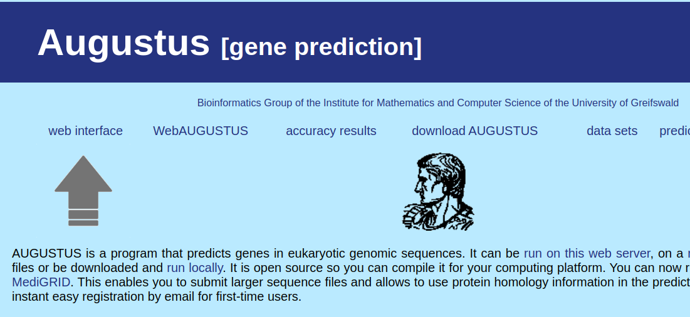
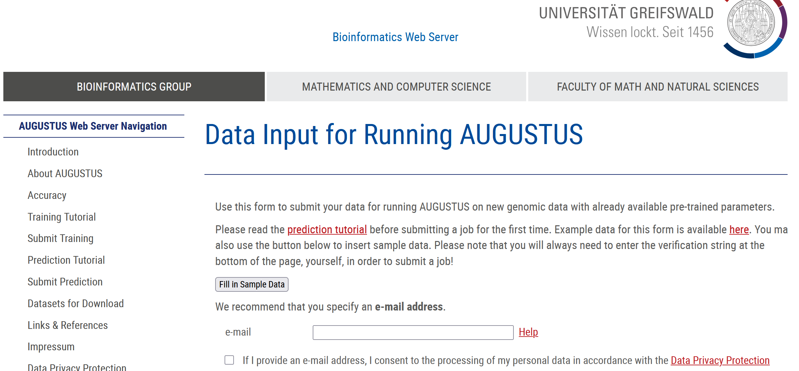
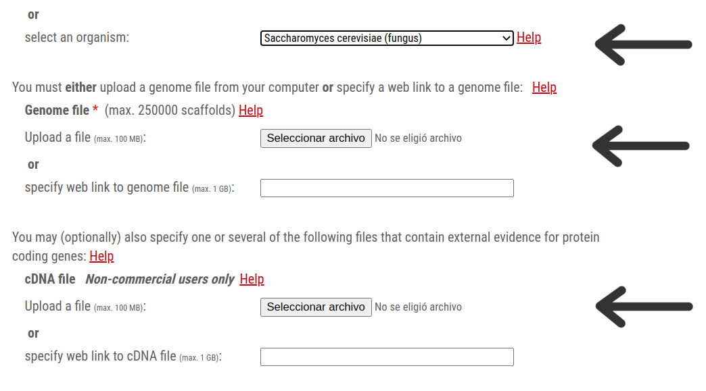

# 🧬 Practical 04 - Gene Prediction and Annotation in Saccharomyces cerevisiae

In this practical we will perform gene prediction on the assembled genomes of *Saccharomyces cerevisiae* using the web tool Augustus.
Augustus can combine statistical models (ab initio), gene expression data, and evolutionary conservation to predict gene structures.
In our case, we will use a combination of Hidden Markov Models (HMM) and expression data, and we will then evaluate the predictions using BUSCO (Benchmarking Universal Single-Copy Orthologs).


---

In previous practicals, we generated assemblies using different sequencing technologies (Nanopore, Illumina) and assemblers (ABySS, Flye).
We also observed that Illumina-only assemblies generated with ABySS were more fragmented.

---


## ⚠️  Before starting

Before starting this practical, make sure to activate the conda environment that contains the required programs.
This ensures that all tools are available from the command line.

   ```bash
   conda activate day1
   ```
   
---

##  📔 Part A – Gene Prediction

### ✏️ A.1. Chromosome-level annotation

We will use the classic Augustus web server http://bioinf.uni-greifswald.de/augustus/, which provides fast results, to explore alternative strategies for gene prediction using Chromosome II of *S. cerevisiae*.


&nbsp;

To do this, we first need to obtain the contigs corresponding to Chromosome II from our assembly.

We will use the BLAST output (assembly vs reference genome, i.e., YEAST_chromosome.fas) to extract the contig names that match Chromosome II (BK006936.2_C_II|) for both assemblies: the one generated with ABySS and the one generated with Flye.

As in the previous practical, follow these steps:

1. Identify the contigs corresponding to Chromosome II of S. cerevisiae.
To do this, inspect the BLAST output comparing your assembly against the reference genome and retain the most representative hits.

⚠️ Warning: If you are not currently inside the folder containing the BLAST results, you must provide the full path to the BLAST output file.

```bash
grep "_C_II|" yeastk94_vs_Ref.blast | awk '$4>1000'  | awk '{print $1}' | sort | uniq > names_ch2_abyss.txt
grep "_C_II|" yeastFly_vs_Ref.blast | awk '$4>10000' | awk '{print $1}' | sort | uniq > names_ch2_flye.txt
```

2. Generate a FASTA file containing only the contigs that match Chromosome II.

⚠️ Warning: If you are not inside the folder where your input files are located, you must specify the complete path to them.

```bash
seqkit grep -f names_ch2_abyss.txt abyss_yeast/yeast_k94-scaffolds.fa > Ch2_abyss.fas
seqkit grep -f names_ch2_flye.txt flye_yeast/assembly.fasta > Ch2_flye.fas
```

---


### ✏️ A.2. Running Augustus web interface

Open two tabs of the Augustus **web interface**.
In each one, run a prediction for the Illumina assembly and the Flye assembly.
Select *Saccharomyces cerevisiae* as the species.
Click The graphical and text results are here, then right-click on text results (gff) and open in a new tab.

- You can save these results as text files with Ctrl + S.

- Repeat the same for predicted amino acid sequences and predicted coding sequences.

Then, obtain some basic statistics for each prediction:

* Number of genes
* Number of transcripts
* Number of introns

You can easily extract this information from the .gtf filesor create a spreadsheet (e.g., Excel or Calc):

 (ignore comment lines starting with #) 
 
```bash
grep -c -w "gene" augustus.gtf
grep -c -w "transcript" augustus.gtf
grep -c -w "intron" augustus.gtf
```

Get the number of genes with introns and with more than one intron:

```bash
grep -w "intron" augustus.gtf | awk '{print $NF}' | sort | uniq | wc -l
grep -w "intron" augustus.gtf | awk '{print $NF}' | sort | uniq -c | sort -nr -k1 | grep -v ^" *1" | wc -l
```

Calculate the average CDS length and protein length using infoseq and awk:

```bash
infoseq -only -length augustus.aa | awk '{ sum += $1} END { print sum/NR }'
infoseq -only -length file.cds | awk '{ sum += $1} END { print sum/NR }'
```

- 🧩 Discuss: What differences do you observe between the predictions from both assemblies?

---


### ✏️ A.3. Genome-wide gene prediction with Augustus

For annotation, we will use *S. cerevisiae* cDNA data (mRNA.fas) to confirm gene models.
Run Augustus predictions on both assemblies via the web server:
👉 http://bioinf.uni-greifswald.de/webaugustus/

* Upload your genome assembly, select Saccharomyces cerevisiae as the species, and include the cDNA file if available.

* Keep other parameters as default.
*   Once finished, Augustus will send an email containing a link to download the results (predictions.tar.gz).


&nbsp;


&nbsp;

🕒 Because this process can be time-consuming, we will use precomputed gene predictions that have already been generated.

ABYSS_94:

https://bioinf.uni-greifswald.de/webaugustus/prediction/show/0db58ea195eecf5d019683c98838016b

Nanopore flye:

https://bioinf.uni-greifswald.de/webaugustus/prediction/show/0db58ea195eecf5d01967ee8afd7015d


It will contain:

augustus.aa         # predicted amino acid sequences

augustus.codingseq  # predicted coding sequences (DNA)

augustus.cdsexons   # predicted exon sequences

augustus.gtf        # gene predictions in GTF format

augustus.gff        # gene predictions in GFF format

Also are available at 
You can copy the aminoacid prediction to perform the BUSCO evaluation

```bash
cp /mnt/lab/Data/day1/augustus_abyss/augustus_abyss.aa ./
cp /mnt/lab/Data/day1/augustus_flye/augustus_flye.aa ./
```

- 🧩 **Discuss the results**

- How many proteins were predicted for abyss and how many for flye?
- Why do you think this result occurred?
---


### ✏️ Part A.4 – Evaluating Predictions with BUSCO

We will evaluate Augustus predictions using BUSCO (Benchmarking Universal Single-Copy Orthologs).

BUSCO searches for sets of conserved single-copy genes (BUSCOs) expected to be present in all genomes of the target lineage.
If many BUSCOs are missing, it suggests incomplete or fragmented gene predictions.

We will test predictions obtained from:

Illumina assembly (ABySS)

Long-read assemblies (Nanopore using Flye)

Copy your predicted protein files and run BUSCO:

```bash
# For amino acid sequences from abyss assembly:
busco -i augustus_abyss.aa -o BUSCO_abyss -l saccharomycetes_odb10 -m proteins -f
# For amino acids from Flye assembly: 
busco -i augustus_flye.aa -o BUSCO_nanoporeF -l saccharomycetes_odb10 -m proteins -f

```


- 🧩 **Discuss the results**