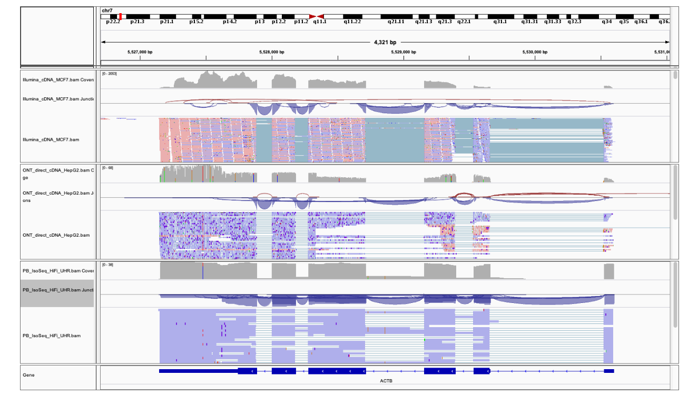

# 🧮 Practical 2A – Exploring Long-Read RNA Sequencing Data in IGV

## Introduction

In this practical, we will use data from the paper *Chen et al., 2025, "A systematic benchmark of Nanopore long-read RNA sequencing for transcript-level analysis in human cell lines" (Nature Methods, 22:801–812)*.  
This study compares five RNA-seq protocols — including Illumina short-read, Oxford Nanopore direct RNA, direct cDNA, PCR cDNA, and PacBio IsoSeq — across multiple human cell lines. The authors show that long-read RNA sequencing more robustly identifies major isoforms and provides higher correlation between estimated and expected transcript expression levels compared to short-read RNA-seq. They further demonstrate that transcript quantification is sensitive to RNA fragmentation and reduced read length, which can inflate expression estimates for some isoforms in short-read data.  
Despite these differences, aggregated gene-level expression remains highly consistent across technologies, confirming that short-read RNA-seq still provides reliable estimates for gene expression.  

<p align="center">
  
  <br>
  <em></em>
</p>


In this session, we will explore examples of short- and long-read RNA-seq data from this benchmark to visualize differences in read length, coverage, and transcript structure.


## Objective

You will compare different sequencing technologies (Illumina, Oxford Nanopore, and PacBio) using aligned reads in **IGV (Integrative Genomics Viewer)** to explore how read length and error rate affect transcript visualization and interpretation.


---
## Before starting

Make sure you are in the correct working directory to run this practical.

```bash
# Enter the course folder
cd essentials_bioinformatics_2025/

# List the contents
ls

# Enter the folder corresponding to the current day (in this case, day1)
cd day2
```

## Datasets


There are examples of Illumina, ONT, and PacBio BAM files in the folder:
```bash

ls -lrt /mnt/lab/Data/day2/practical1/bams/

```


## ℹ️ RNA-seq visualization with IGV


The Integrative Genomics Viewer ([IGV](https://igv.org/doc/desktop/)) is a java-based desktop application for the interactive visual exploration of integrated genomic datasets. It was developed by the Broad Institute.

With IGV you can: explore large genomic datasets with an intuitive, easy-to-use interface; integrate multiple data types with clinical and other sample information; and view data from multiple sources: local, remote, and “cloud-based”.

The basics for using IGV:

1. launch IGV
2. select a reference genome
3. load data (e.g. bam files)
4. navigate through the data

📘 For more details explore IGV webpage. Also, a tutorial is available with the course materials.

### Useful Links
- [IGV Download Page](https://software.broadinstitute.org/software/igv/download)
- [IGV Documentation](https://software.broadinstitute.org/software/igv/UserGuide)
- [SG-NEx Data Resource (Goeke Lab)](https://github.com/GoekeLab/sg-nex-data)


&nbsp;

The screen layout of IGV has different panels and tracks. At the top, you can find the genome rule. At the bottom, RefSeq gene annotations are provided. Usually, tracks can be shown in collapsed, squished and expanded forms. The data format (alignment, gene annotation, variant file, etc) determines the track type and the specific display options.

<p align="center">
  
  <br>
  <em>This layout shows samples of the Encode project where genomic DNA was enriched for methylation of histones.</em>
</p>


There are several options to navigate in the IGV:

* e.g. click on chromosome X to move to chromosome X

* select a genomic position or gene name in the Search box

* click anywhere in the data panel and drag tacks left and right

* doble-click in a track to zoom in for a closer view

* click and drag on the genomic ruler to zoom in

* click on the last tick on the railroad track to zoom in to maximum resolution (at maximum zoom we move from whole genome to base pair resolution)

* you can press the “home” button to recover the whole-genome view

  

The gene annotation track can be displayed in compact, squished, or expanded format. Right-click on a track and you will have several formatting options.


<p align="center">
  
  <br>
  <em></em>
</p>
 
The display of RNA-seq data has its own peculiarities. In addition to the read alignments, a coverage plot and a junction track can be shown. You can change this in `View > Preferences > Alignments`.

<p align="center">
  
  <br>
  <em></em>
</p>


&nbsp;

<font color="green">

### 🧩 Explore the long- and short-read RNA-seq bams

Enter IGV and load  **GRCh38** as the reference genome. Then, load the three different provided bam files:

1. Go to `Menu > File > Load from File…`  

   - you may load them **one by one**, or  
   - select **multiple files at once** using `Ctrl`. 

Note: Make sure to also load the corresponding `.bai` index files if not automatically detected.

2. Move along the chromosome and/or select some genes to look at the aligned reads. E.g.: ACTB (beta-actin, highly expressed); DGCR8 (gene involved in microRNA biogenesis); CHEK2 (tumor-suppressor gene involved in DNA repair); SNRPD3 (spliceosome component); COX6B1 (mitochondrial protein of high expression in metabolic active tissues).

</font>

&nbsp;


### 🧩 Analyzing the visualization for the different RNA-seq technologies


<p align="center">
  
  <br>
  <em>IGV view showing coverage and aligned reads for the ACTB gene using Nanopore, PacBio and Illumina data.</em>
</p>

  
&nbsp;


1. Which of the sequencing technologies shows the highest error rate? (*Hint: Observe read mismatches and alignment noise in IGV.*)
2. Does a high error rate prevent full-length transcript identification? (*Think about read length, coverage, and splice junction completeness.*)
3. How does read length influence your ability to distinguish between isoforms of the same gene?

</font>

&nbsp;
&nbsp;
